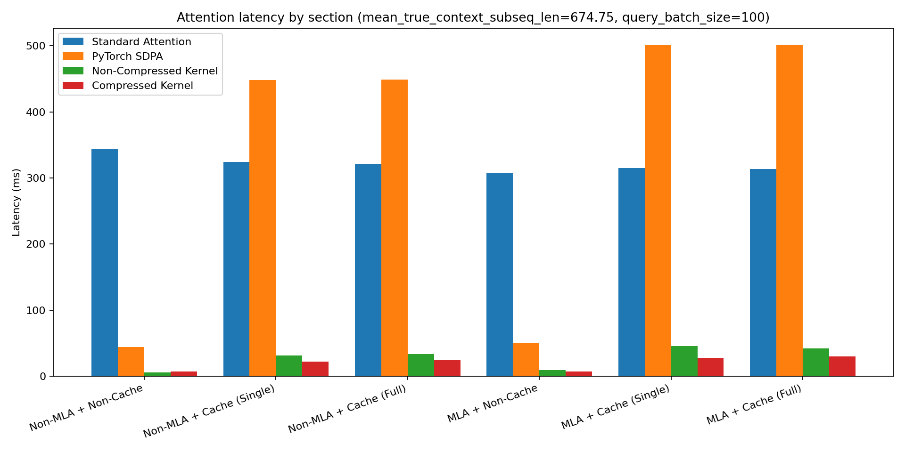

# flash-mlm

Triton-based attention kernels optimized for MLM-based models, in PyTorch.

## Highlights

- ✅ Packed variable-length query/key/value path
- ✅ Optional layer-scoped KV cache (`InferenceCache`) for both dense + packed paths
- ✅ Dense (`flash_attn_mlm`) and compressed (`flash_attn_mlm_compressed`) host launchers
- ✅ Inline prefill support (`prefill=True`) for iterative inference flows
- ✅ Reusable packing workspace + metadata cache (`PackingCache`)
- ✅ Optional cumulative query attention in packed mode (`causal_query_seq_attn=True`)
- ✅ MLA + non-MLA support (no RoPE)
- ✅ Benchmarks for context scaling and batch scaling

```text
[B,H,N,D] padded tensors
   -> pack metadata
   -> fused Triton MLM kernel
   -> packed output
   -> unpack to [B,H,N,D]
```

## On the Roadmap

- **Backpropagation support**
  Prefer using `flash_attn_varlen_func` for training today; native backward support
  here is still on the roadmap.

- **Faster tile scheduling**
  Current packing removes padding tokens, but host-side scheduling/packing overhead
  is still an optimization target.

- **Variable context batch sizes**
  Today we support either a single shared context or full-batch context.
  Intermediate/index-mapped context batching is planned.

- **RoPE compatibility with MLA**
  RoPE is not currently supported with MLA.

- **Paged attention for KV cache**

Contributions are most welcome!

## Requirements

- Linux
- Python `>=3.11,<3.12`
- GPU runtime compatible with your installed `torch` + `triton`

## Install

```bash
# latest main
pip install "flash-mlm @ git+https://github.com/vymao/flash-mlm.git"

# pinned tag
pip install "flash-mlm @ git+https://github.com/vymao/flash-mlm.git@v0.1.0"
```

## Quick usage

### 1) Compressed path (packed queries)

```python
import torch
from flash_mlm import (
    InferenceCache,
    flash_attn_mlm_compressed,
    build_pack_metadata,
    unpack_from_kernel,
)

B, H, N, D = 2, 8, 128, 64
q = torch.randn(B, H, N, D, device="cuda", dtype=torch.float16)
k = torch.randn_like(q)
v = torch.randn_like(q)

lengths_q = torch.tensor([N, N - 16], device="cuda", dtype=torch.int32)
q_meta = build_pack_metadata(lengths_q, N=N, block_n=64)

cache = InferenceCache()
layer_id = 0

packed_out = flash_attn_mlm_compressed(
    q,
    k,
    v,
    num_heads=H,
    q_meta=q_meta,
    scale=1.0 / (D ** 0.5),
    inference_cache=cache,
    layer_id=layer_id,
    # prefill=True stores this call's packed K/V as next-step context.
    prefill=True,
    # Optional: each query subsequence can attend previous subsequences.
    causal_query_seq_attn=True,
)
out = unpack_from_kernel(packed_out, q_meta, H=H)
```

### 2) Dense path (non-packed)

```python
import torch
from flash_mlm import InferenceCache, flash_attn_mlm

B, H, N, D = 2, 8, 128, 64
q = torch.randn(B, H, N, D, device="cuda", dtype=torch.float16)
k = torch.randn_like(q)
v = torch.randn_like(q)

cache = InferenceCache()
layer_id = 0

out = flash_attn_mlm(
    q,
    k,
    v,
    scale=1.0 / (D ** 0.5),
    inference_cache=cache,
    layer_id=layer_id,
    prefill=True,
)
```

## Cache + prefill semantics

- `inference_cache` and `layer_id` must be provided together (or both omitted).
- `prefill=True` requires `inference_cache`.
- On cache miss, launchers run with empty context.
- On prefill, current call K/V are stored for the provided `layer_id`.
- `InferenceCache.prefill_kv_cache(...)` supports both:
  - dense-style prefill (omit `cu_seqlens_kv`)
  - packed/varlen prefill (provide `cu_seqlens_kv`)

## Cumulative query attention (packed path)

`flash_attn_mlm_compressed` supports cumulative query attention via
`causal_query_seq_attn=True`.

When enabled, each query subsequence can attend to packed main tokens from
previous query subsequences in the same batch (in addition to any cached
context).

## Public API

- `flash_attn_mlm`
- `flash_attn_mlm_compressed`
- `InferenceCache`
- `PackingCache`
- `PackMetadata`
- `build_pack_metadata`
- `unpack_from_kernel`

## Benchmarking

```bash
python src/benchmark/benchmark_mlm_nctx.py
python src/benchmark/benchmark_mlm_batch.py
python src/benchmark/standard_kernel/benchmark_mlm_vs_torch.py
```

Outputs are written to `plots/`.

### Four-way latency comparison

Generated by `benchmark_mlm_vs_torch.py`:



## Development

```bash
poetry install
poetry run pytest -q src/flash_mlm/test_host_utils.py
poetry run pytest -q src/flash_mlm/test.py -k "mlm_dense or mlm_compressed"
```
